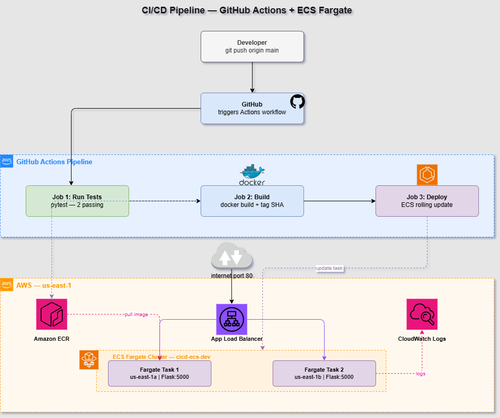
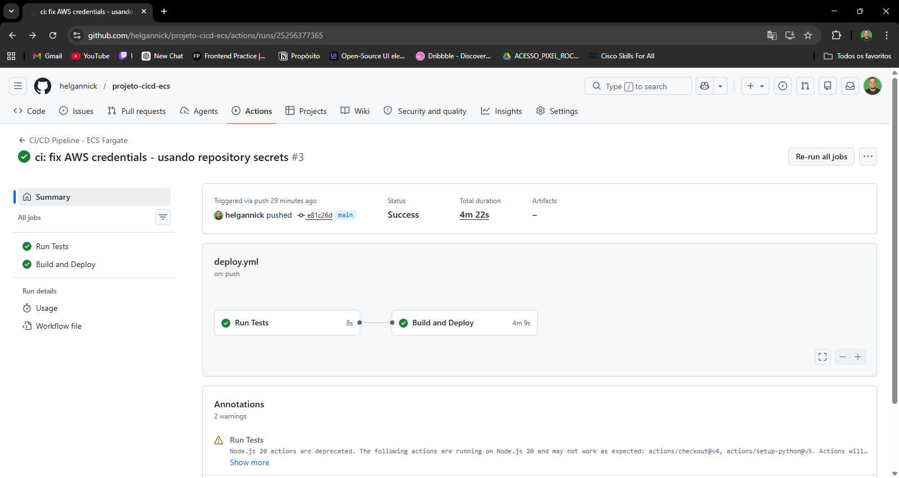
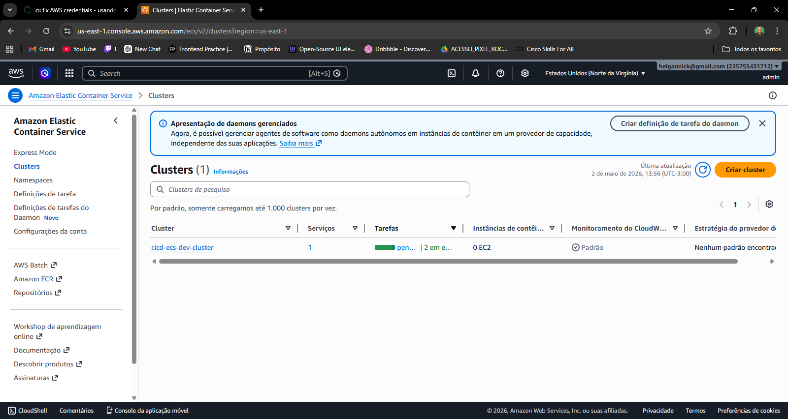
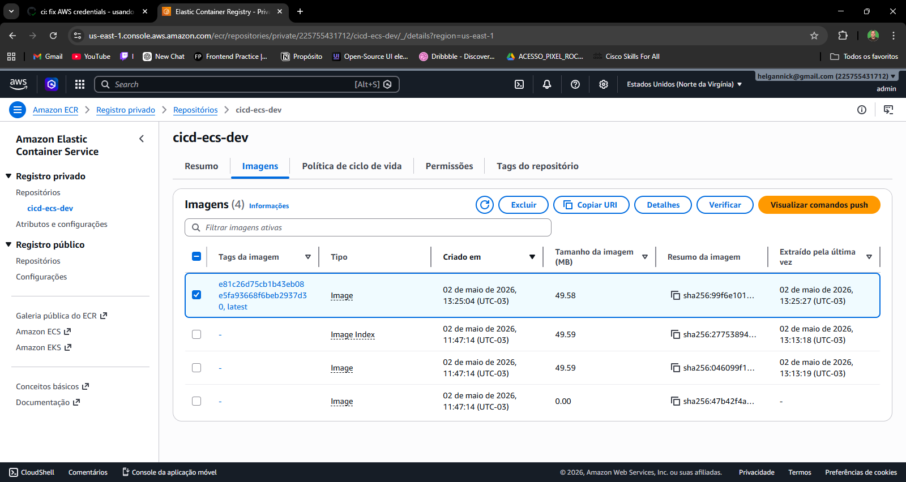

# 🚀 CI/CD Pipeline — GitHub Actions + ECS Fargate
 


 
> Pipeline CI/CD completa e automatizada com GitHub Actions, Docker, Amazon ECR e ECS Fargate. A cada push na branch main, o código é testado, containerizado, publicado no ECR e deployado automaticamente no ECS com zero-downtime.
 
---
 
## ⚡ Como funciona
 
```
Developer faz git push
        │
        ▼
┌─────────────────────────────────────────┐
│         GitHub Actions Pipeline          │
│                                         │
│  1. Run Tests (pytest)                  │
│     └── 2 testes automatizados          │
│                                         │
│  2. Build and Deploy                    │
│     ├── Configure AWS credentials       │
│     ├── Login no Amazon ECR             │
│     ├── docker build + tag + push       │
│     ├── Update ECS Task Definition      │
│     └── Deploy no ECS Fargate           │
└─────────────────────────────────────────┘
        │
        ▼
App rodando na internet via ALB
(zero-downtime rolling update)
```
 
---
 
## 🏗️ Arquitetura
 
    
 
---

## 📸 Screenshots

### Pipeline GitHub Actions


### App rodando no ECS Fargate


### Amazon ECR com imagem versionada

 
## 🧱 Stack
 
| Camada | Tecnologia |
|---|---|
| Aplicação | Python 3.12 + Flask + Gunicorn |
| Container | Docker |
| Registry | Amazon ECR (scan de vulnerabilidades ativo) |
| Orquestração | Amazon ECS Fargate |
| Load Balancer | Application Load Balancer |
| Pipeline | GitHub Actions |
| Infraestrutura | Terraform |
| Monitoramento | CloudWatch Logs |
| Testes | pytest |
 
---
 
## 📁 Estrutura do Projeto
 
```
projeto-cicd-ecs/
│
├── app/
│   ├── app.py              # Aplicacao Flask
│   ├── requirements.txt    # Dependencias Python
│   └── test_app.py         # Testes pytest
│
├── .github/
│   └── workflows/
│       └── deploy.yml      # Pipeline CI/CD completa
│
├── terraform/
│   ├── main.tf             # ECR, VPC, ECS, ALB, IAM
│   ├── variables.tf        # Variaveis de entrada
│   └── outputs.tf          # Outputs (ECR URL, ALB DNS)
│
├── Dockerfile
└── README.md
```
 
---
 
## 🔄 Pipeline em Detalhes
 
### Job 1 — Run Tests
```yaml
- Checkout do codigo
- Setup Python 3.12
- Instala dependencias
- Executa pytest
```
 
### Job 2 — Build and Deploy (apenas na branch main)
```yaml
- Configure AWS credentials (via GitHub Secrets)
- Login no Amazon ECR
- docker build + tag com commit SHA + push
- Download da Task Definition atual do ECS
- Atualiza Task Definition com nova imagem
- Deploy no ECS com wait-for-service-stability
```
 
---
 
## 🔒 Segurança
 
- Credenciais AWS armazenadas como **GitHub Secrets** — nunca no código
- Imagens com **scan automático de vulnerabilidades** no ECR
- Security Group do ECS aceita tráfego **apenas do ALB** (porta 5000)
- ALB exposto na porta 80 — ECS nunca exposto diretamente
- IAM Role com **menor privilégio** para execução das tasks
---
 
## 📊 Endpoints da Aplicação
 
| Endpoint | Método | Resposta |
|---|---|---|
| `/` | GET | JSON com info do container |
| `/health` | GET | `{"status": "healthy"}` |
 
**Exemplo de resposta do `/`:**
```json
{
  "author": "Marcos Barbosa",
  "hostname": "ip-10-0-1-45.ec2.internal",
  "project": "CI/CD Pipeline - ECS Fargate",
  "status": "healthy",
  "timestamp": "2026-05-02T16:15:17.507573+00:00",
  "version": "1.1.0"
}
```
 
---
 
## 🚀 Como fazer deploy
 
### Pré-requisitos
- AWS CLI configurado
- Terraform >= 1.3
- Docker instalado
- GitHub Secrets configurados
### 1. Configura os secrets no GitHub
 
```
AWS_ACCESS_KEY_ID
AWS_SECRET_ACCESS_KEY
AWS_REGION
```
 
### 2. Provisiona a infraestrutura
 
```bash
cd terraform
terraform init
terraform apply -var="app_image=public.ecr.aws/nginx/nginx:latest"
```
 
### 3. Push da imagem inicial para o ECR
 
```bash
aws ecr get-login-password --region us-east-1 | \
  docker login --username AWS --password-stdin <ECR_URL>
 
docker build -t cicd-ecs-dev .
docker tag cicd-ecs-dev:latest <ECR_URL>:latest
docker push <ECR_URL>:latest
```
 
### 4. A partir daqui, o deploy é automatico!
 
```bash
git push origin main  # Pipeline dispara automaticamente
```
 
---
 
## 🧪 Testes
 
```bash
# Instala dependencias
python -m venv venv
source venv/bin/activate
pip install flask pytest
 
# Roda os testes
python -m pytest app/ -v
```
 
```
collected 2 items
app/test_app.py::test_home    PASSED
app/test_app.py::test_health  PASSED
2 passed in 0.11s
```
 
---
 
## 🧹 Destruir infraestrutura
 
```bash
# Deleta imagens do ECR primeiro
aws ecr batch-delete-image \
  --repository-name cicd-ecs-dev \
  --image-ids imageTag=latest
 
# Destroi todos os recursos
cd terraform
terraform destroy
```
 
---
 
## 💰 Custo Estimado
 
| Recurso | Custo/hora |
|---|---|
| ECS Fargate (2 tasks 0.25 vCPU) | ~$0.010 |
| ALB | ~$0.008 |
| ECR | ~$0.001 |
| **Total** | **~$0.02/hora** |
 
---
 
## 📚 Skills demonstradas
 
- **CI/CD** com GitHub Actions — pipeline completa e automatizada
- **Containers** — Docker, imagens otimizadas com Python slim
- **Amazon ECR** — registry privado com scan de vulnerabilidades
- **Amazon ECS Fargate** — containers serverless sem gerenciar servidores
- **Zero-downtime deployment** — rolling update com health checks
- **Infraestrutura como Codigo** — Terraform com 19 recursos
- **Segurança** — IAM least privilege, secrets, Security Groups por camada
- **Testes automatizados** — pytest integrado na pipeline
---
 
## 👤 Autor
 
**Marcos Barbosa**
- LinkedIn: [linkedin.com/in/60bb4023b](https://linkedin.com/in/60bb4023b)
- GitHub: [github.com/helgannick](https://github.com/helgannick)
- Email: marcdev.b@gmail.com
AWS Certified Solutions Architect – Associate | AWS Certified Cloud Practitioner | UiPath Automation Developer Associate
 
---
 
## 📄 Licenca
 
MIT License